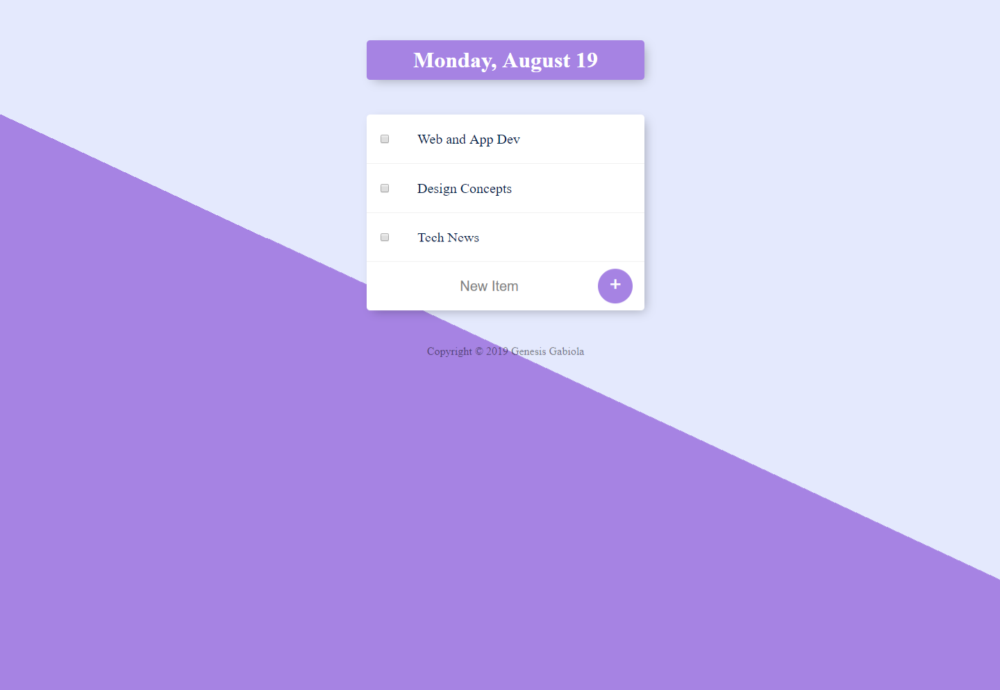

# TodoList

A todo list to keep track everything in one place. Just list all the tasks, so you get it out of your head and enjoy your peace of mind along the way.

## Built with:

- HTML5
- CSS3
- Node
- Express
- EJS



Visit the [live preview](https://makelist.herokuapp.com/).

## Installation

Clone the repository, change to the directory, and use npm to install dependencies.

```sh
$ git clone hhttps://github.com/genesisgabiola/todolist.git
$ cd todolist
$ npm install
```

## Usage

- The project can be run with npm
- Open your browser and launch the website at [localhost:3000](https://localhost:3000).

```sh
$ npm start
```

## Future Improvements:

- [ ] Improve the UI and UX.
- [ ] Maybe add some animations on it.
- [ ] add a database storage.

## How to Contribute?

- Open an [issue](https://github.com/genesisgabiola/todolist/issues).
- Contact me on [twitter](http://twitter.com/genesisgabiola).

Any queries, suggestions, issues to report or critics are welcome :) You can freely connect to me.